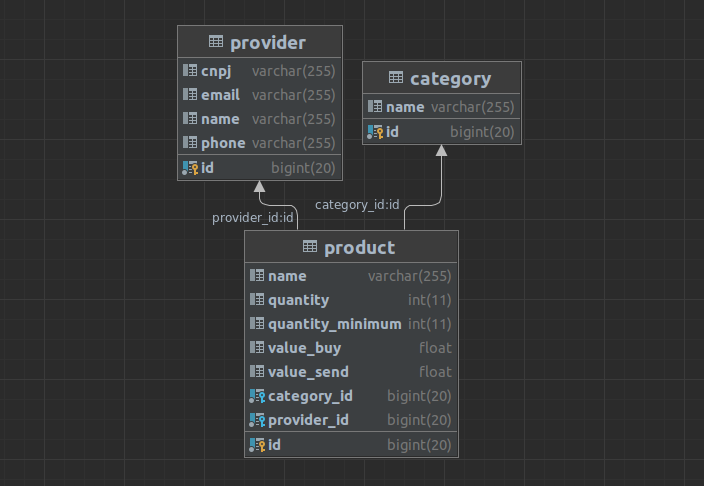

## Tarefa 1: Desenvolver uma API

Você deverá desenvolver uma API (Restful) simples que receba uma requisição HTTP com uma string, e encontre o primeiro caractere Vogal, após uma consoante, onde a mesma é antecessora a uma vogal e que não se repita na string.

Premissas:

Não será possível reiniciar o fluxo da leitura da string.
Na tarefa 1 não poderá ser utilizado nenhuma lib, apenas código nativo na identificação da vogal.

Exemplo:

Input: aAbBABacafe
Output: e

No exemplo, ‘e’ é o primeiro caractere Vogal da stream que não se repete após a primeira Consoante ‘f’ o qual tem uma vogal ‘a’ como antecessora.

E o resultado do processamento deverá ser igual à:
```json
{
  "string": " aAbBABacafe",
  "vogal": "e",
  "tempoTotal": "10ms"
}
```

## Tarefa 2: Criar uma aplicação Web

Como de costume, o setor de vendas está precisando melhorar a gestão dos produtos em estoque, e você poderá ajudar eles. Cada produto possui um nome, um valor de compra, a categoria a qual ele pertence (Frutas, Cereais, Legumes…) e o fornecedor do produto (empresa). 

Seu trabalho será criar uma aplicação Web para que os responsáveis pelo setor de vendas possam: catalogar e gerenciar os produtos vendidos pela empresa, atualizar o estoque com a quantidade disponível e o valor para venda e gerar um relatório informativo sobre o setor. O relatório deve apresentar em forma de tabelas os seguintes dados: 
- Listagem das categorias juntamente com suas quantidades totais de produtos em estoque;
- Listagem dos produtos que estão faltando em estoque;
- Listagem dos fornecedores que possuem produtos faltando em estoque;

**Obs:** As tarefas 1 e 2 deverão ser desenvolvidas dentro da mesma aplicação Web.

``A modelagem dos problemas e a organização (código, repositório, interface gráfica...), serão considerados na pontuação do processo seletivo.``

``Você deverá hospedar a tarefa na nuvem e enviar por email as instruções necessárias para para acesso da aplicação. Também deverá ser enviado o link do repositório que se encontra o código fonte.``


## 1. Desafio Backend

<p> Crianção de uma API RESTful utilizando Java (Spring Boot), a partir do banco de dados definido abaixo: </p>



<p>Vale ressaltar que tal aplicação se encontra rodando na seguinte URL: "https://desafiobackend.herokuapp.com/"</p>


## 2. Desafio Frontend

<p> Crianção de uma aplicação web utilizando Angular e Typescript, que se encontra rodando na seguinte URL:"https://desafiofrontend.herokuapp.com/"</p>

## 3. Desafio Lógico
<p>Foi criada uma rota para tal: a "/logicProgram", que recebe um Request Paramêtro do tipo String chamada "strToAnalyse"</p>